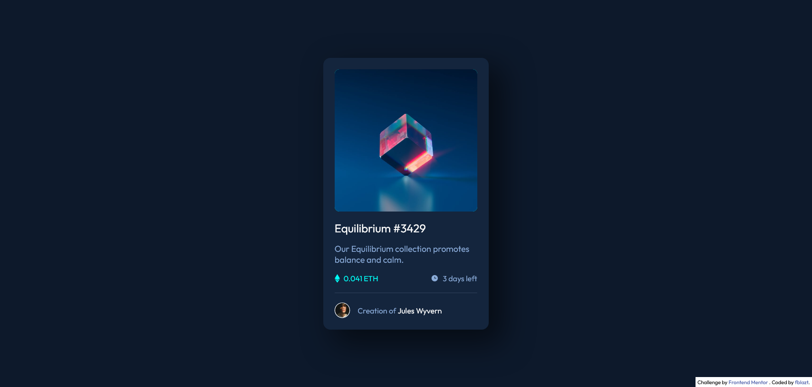

# Frontend Mentor - NFT preview card component solution

This is a solution to the [NFT preview card component challenge on Frontend Mentor](https://www.frontendmentor.io/challenges/nft-preview-card-component-SbdUL_w0U).

## Table of contents

- [Overview](#overview)
  - [The challenge](#the-challenge)
  - [Screenshot](#screenshot)
  - [Links](#links)
- [My process](#my-process)
  - [Built with](#built-with)
  - [Useful resources](#useful-resources)
- [Author](#author)

## Overview

### The challenge

Users should be able to:

- View the optimal layout depending on their device's screen size
- See hover states for interactive elements

### Screenshot

### Links

- Solution URL: [Frontend Mentor solution](https://www.frontendmentor.io/solutions/css-flexbox-css-custom-properties-css-bem-methodology-PSNI-7f6F)
- Live Site URL: [Live Site](https://fblazt-fem-nft.netlify.app/)

## My process

### Built with

- HTML5
- CSS custom properties
- CSS BEM methodology

### Useful resources

- [Image overlay](https://www.w3schools.com/howto/howto_css_image_overlay.asp) - This helped me to implement stacked element, and changing the opacity state between those element without javascript.

## Author

- Frontend Mentor - [@fblazt](https://www.frontendmentor.io/profile/fblazt)
